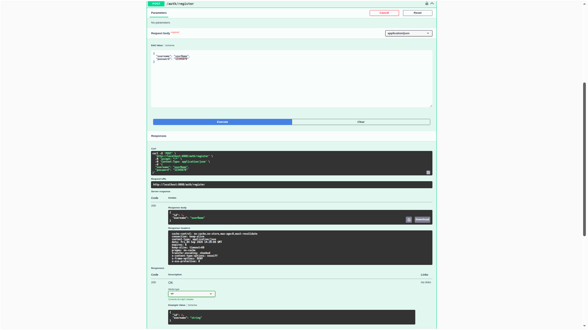
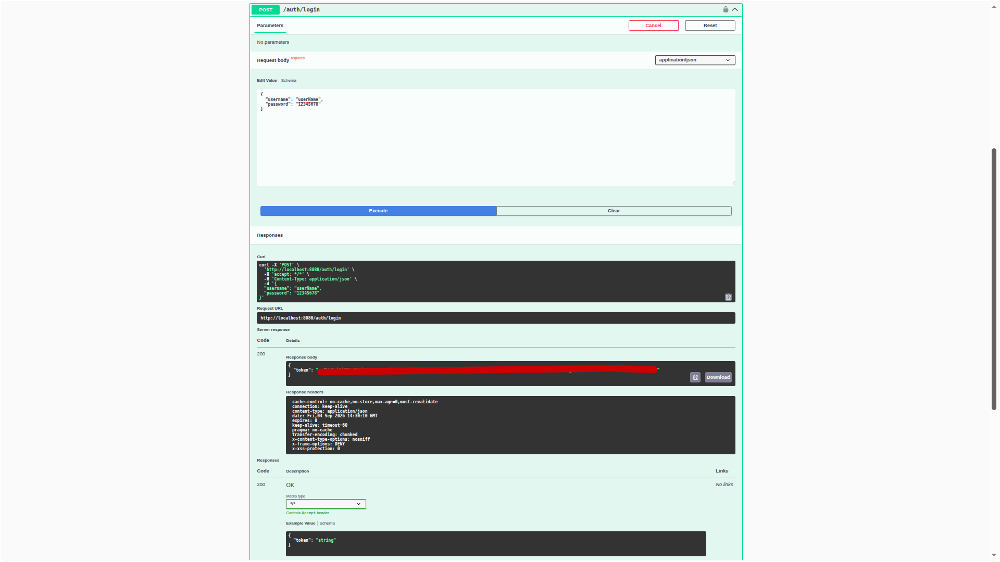
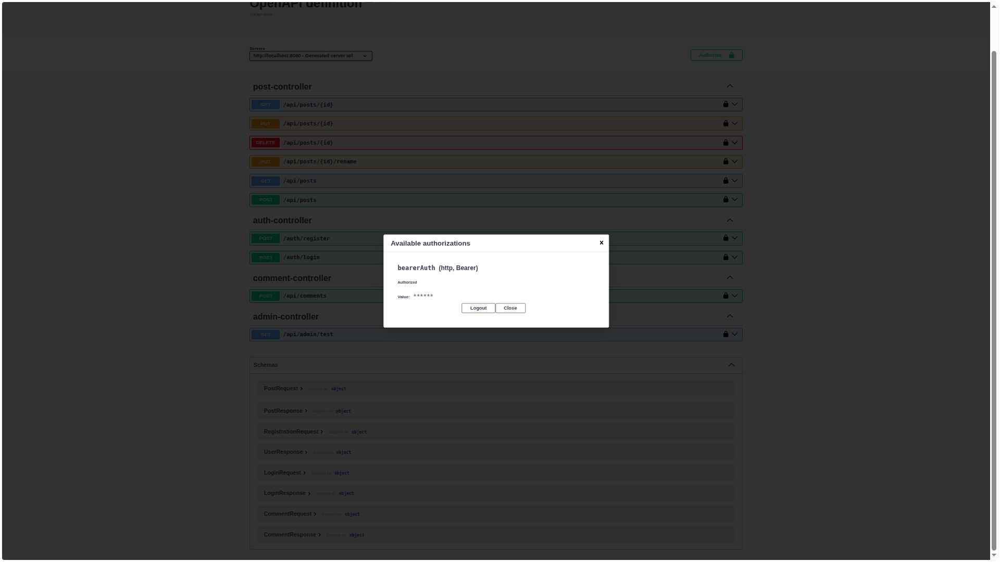
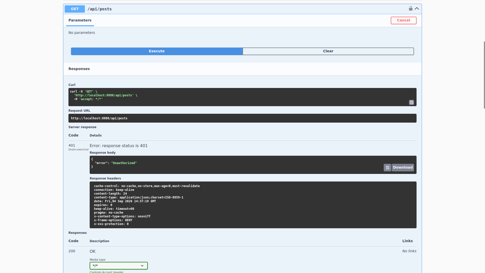
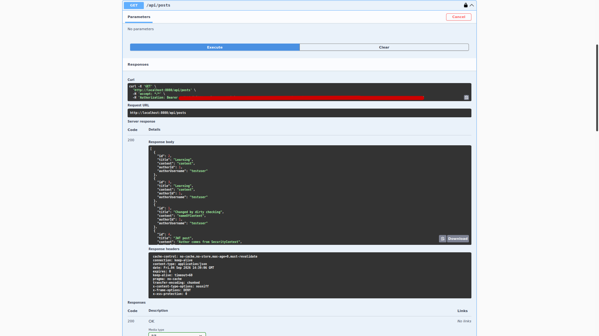
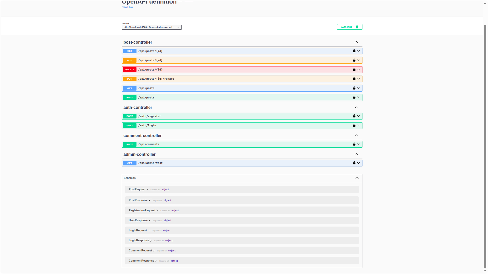
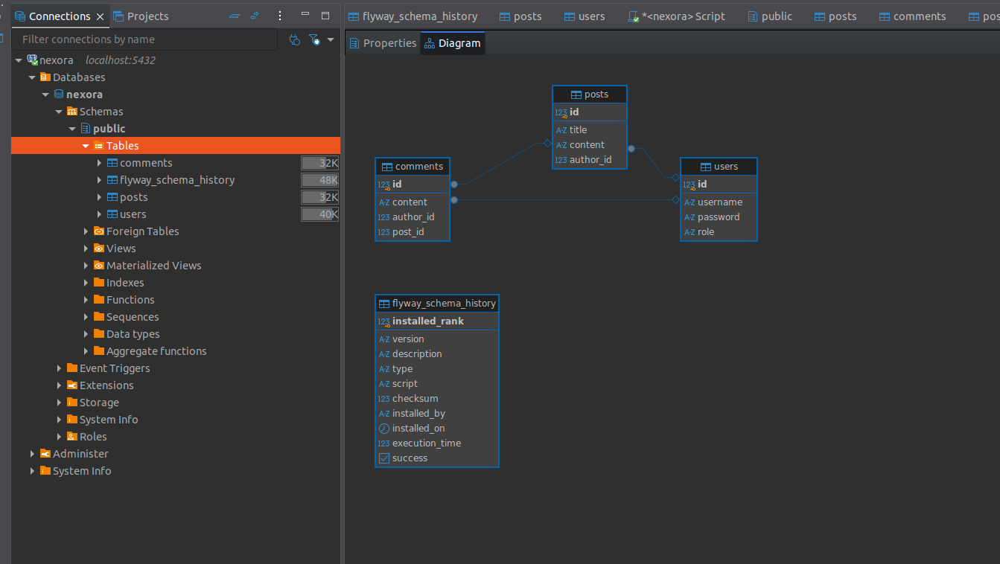

# Nexora

Nexora is a RESTful backend application for a social content platform built with Java and Spring Boot.

The project demonstrates a production-style backend architecture with authentication, authorization, relational data, validation, database migrations, centralized error handling, API documentation, and automated testing.

> This repository is a public showcase of the project.  
> The full application source code is maintained separately.

---

## Live Demo

Nexora is deployed and running in production.

### Web Application

Try the live Nexora application:

**[Open Nexora Web App](https://nexora-frontend-1gmr.onrender.com)**

> Hosted on Render. The application may take a moment to load after a period of inactivity.


### Swagger UI

Explore and test the live REST API through Swagger UI:

**[Open Nexora Swagger UI](https://nexora-9s67.onrender.com/swagger-ui/index.html)**

> The application is hosted on Render's free tier.  
> The first request after a period of inactivity may take some time while the service wakes up.

The production environment uses:

- Docker
- Render Web Service
- PostgreSQL
- Environment-based configuration

---

## Features

- User registration and login
- JWT-based authentication
- Role-based authorization (`USER` / `ADMIN`)
- BCrypt password hashing
- Post CRUD operations
- Post ownership authorization
- Comments
- User-to-post relationships
- User-to-comment relationships
- Request validation
- Global exception handling
- PostgreSQL persistence
- Flyway database migrations
- Swagger / OpenAPI documentation
- Unit testing with JUnit and Mockito

---

## Tech Stack

- Java 21
- Spring Boot
- Spring Web
- Spring Security
- Spring Data JPA
- Hibernate
- PostgreSQL
- Flyway
- JJWT
- Bean Validation
- OpenAPI / Swagger
- JUnit
- Mockito
- Maven
- Git

---

## Architecture

Nexora follows a layered backend architecture:

```text
Client
  │
  ▼
Controller
  │
  ▼
Service
  │
  ▼
Repository
  │
  ▼
PostgreSQL
```

DTOs are used to separate the external API contract from persistence entities.

```text
Request
   │
   ▼
Request DTO
   │
   ▼
Controller
   │
   ▼
Service
   │
   ▼
Entity
   │
   ▼
Repository
   │
   ▼
Database
```

---

## Authentication

Users can create an account through the registration endpoint.

### Registration

`POST /auth/register`



Passwords are not stored as plain text. They are hashed using BCrypt before persistence.

### Login

`POST /auth/login`



After successful authentication, the application generates a signed JWT.

The client can then use this token to access protected endpoints.

### JWT Authorization

Protected requests use the Bearer authentication scheme:

```text
Authorization: Bearer <JWT>
```



Authentication flow:

```text
Client
   │
   │ username + password
   ▼
POST /auth/login
   │
   ▼
AuthService
   │
   │ verify credentials
   ▼
JWT generated
   │
   ▼
Client
   │
   │ Authorization: Bearer <JWT>
   ▼
JwtAuthenticationFilter
   │
   ▼
SecurityContext
   │
   ▼
Protected API
```

---

## Protected API

Spring Security protects application resources from unauthenticated access.

### Request without JWT

A request to a protected endpoint without a valid token is rejected.

```text
GET /api/posts

→ 401 Unauthorized
```



### Request with JWT

After successful authentication, the same protected resource becomes accessible.

```text
Authorization: Bearer <JWT>

GET /api/posts

→ 200 OK
```



This demonstrates that protected endpoints cannot be accessed without authentication.

---

## Authorization

Nexora implements both role-based and resource-based authorization.

### Roles

```text
USER
ADMIN
```

Administrative endpoints are restricted to users with the `ADMIN` role.

### Resource Ownership

Users can modify or delete only posts that belong to them.

```text
Authenticated User
        │
        ▼
      Post
        │
        ▼
Check post.author.id
        │
     ┌──┴──┐
     │     │
   Owner  Not Owner
     │     │
     ▼     ▼
 Allowed  403 Forbidden
```

---

## API Endpoints



### Authentication

```text
POST /auth/register
POST /auth/login
```

### Posts

```text
GET    /api/posts
GET    /api/posts/{id}
POST   /api/posts
PUT    /api/posts/{id}
DELETE /api/posts/{id}
PUT    /api/posts/{id}/rename
```

### Comments

```text
POST /api/comments
```

### Administration

```text
GET /api/admin/test
```

---

## Database

Nexora uses PostgreSQL for persistent storage.

The current domain model contains three main entities:

```text
User
 │
 ├──── Posts
 │
 └──── Comments

Post
 │
 └──── Comments
```

### Database Schema



The database relationships connect users with their posts and comments while preserving ownership information.

---

## Database Migrations

Database schema changes are managed using Flyway.

```text
V1 — Create posts
V2 — Create users
V3 — Add author to posts
V4 — Create comments
V5 — Add role to users
```

Applied migrations are treated as immutable. New database changes are introduced through new migration versions.

---

## Validation

Incoming requests are validated using Bean Validation.

Examples of validation constraints used by the application include:

```text
@NotBlank
@Size
@Valid
```

Invalid request data results in an HTTP `400 Bad Request` response.

---

## Exception Handling

Centralized exception handling provides consistent API responses for application errors.

Examples:

```text
400 — Bad Request
401 — Unauthorized
403 — Forbidden
404 — Not Found
```

---

## Security

The security layer includes:

- JWT Bearer authentication
- BCrypt password hashing
- Custom JWT authentication filter
- Spring Security `SecurityContext`
- Role-based endpoint protection
- Resource ownership checks
- Stateless authentication

Sensitive configuration values such as JWT secrets and database credentials are supplied through environment variables rather than stored directly in source code.

---

## API Documentation

The REST API is documented using OpenAPI / Swagger.

Swagger UI provides an interactive interface for exploring and testing Nexora endpoints.

---

## Testing

The project uses:

- JUnit
- Mockito
- Spring Boot Test

Automated test coverage is being expanded as the project develops.

---

## Project Status

Nexora is under active development.

Current functionality includes:

```text
Authentication       ✓
JWT Security         ✓
Role Authorization   ✓
Post CRUD            ✓
Post Ownership       ✓
Comments             ✓
PostgreSQL           ✓
Flyway               ✓
Validation           ✓
Swagger              ✓
Unit Tests           In progress
```

Future development will focus on expanding testing and adding additional social platform functionality.
